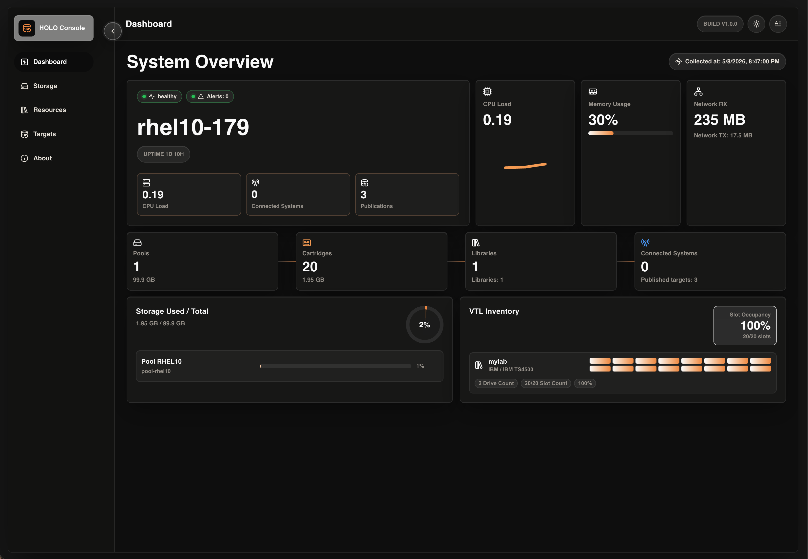
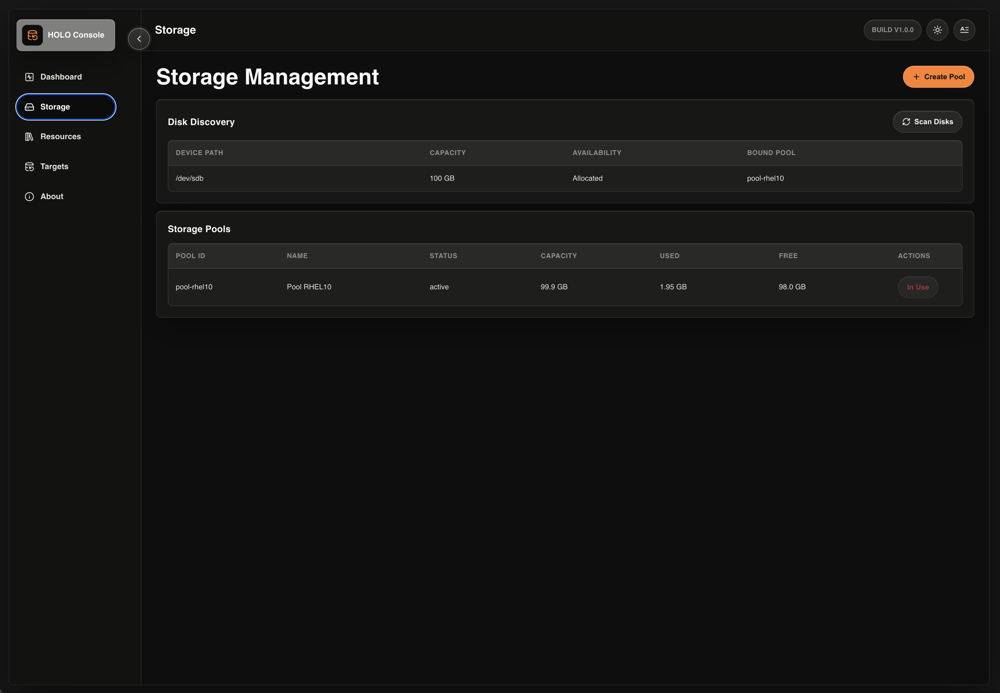
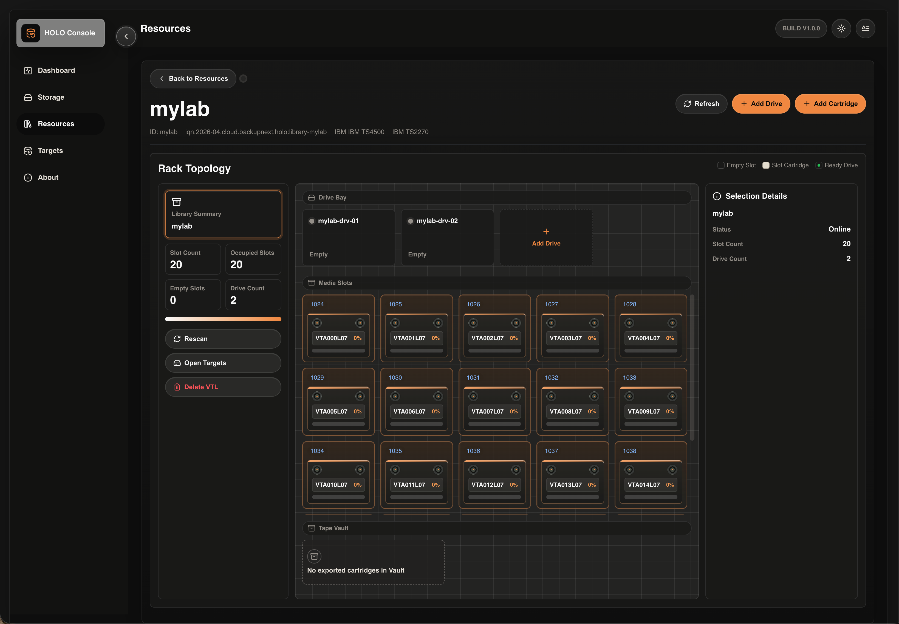

# Holo

**The Holographic Tape Library**

<div align="center">


*Every fragment holds the whole picture.*

[简体中文](README-CN.md) | English

[](LICENSE)
[](https://www.rust-lang.org/)
[](https://go.dev/)
[](https://makeapullrequest.com)


<a href="#installation"></a>&nbsp;
<a href="#quick-start"></a>&nbsp;
<a href="#supported-devices"></a>

</div>

---

## What is Holo?

> **holo** /ˈhɒləʊ/ — from *hologram*. Every fragment holds the whole picture.

Holo is an open-source Virtual Tape Library that projects tape drives and changers over iSCSI. Backup software sees real hardware — no agent, no plugin.

---

## Why Holo?


|                 | Feature                 | Description                                                                                                      |
| --------------- | ----------------------- | ---------------------------------------------------------------------------------------------------------------- |
| **holographic** | **Real SCSI Behavior**  | Full SSC-3 / SMC-3 / SPC-4 compliance — INQUIRY, MODE SENSE, LOG SENSE, PERSISTENT RESERVE, WORM, MAM attributes |
| **fast**        | **Rust Data Plane**     | Zero `unsafe`, zero-copy I/O, append-only segment storage with LZ4/Zlib compression and dedup                    |
| **safe**        | **Crash-Proof Storage** | Atomic writes (tmpfile → fsync → rename → dirsync) — no data loss on power failure                               |
| **wide**        | **48 Drive Profiles**   | IBM LTO-1 through LTO-9, HP Ultrium, Quantum SuperLoader, Dell TL/ML, STK, Spectra, Overland                     |
| **easy**        | **One-Click Install**   | Single shell script sets up everything — data-plane binary, control-plane API, web console                       |
| **open**        | **MIT Licensed**        | Fully open source. No vendor lock-in. No hidden telemetry.                                                       |


---

## Architecture

```
 Backup Software (Veeam, NetBackup, IBM TS, Bacula, etc.)
        |
        | iSCSI (standard protocol)
        v
 +------LIO Target (kernel)------+
 |                                |
 |  TCMU (Target Core User-space) |
 |                                |
 +---------------+----------------+
                 |
                 | UNIX socket (CDB frames)
                 v
 +------ Holo Data Plane --------+    +----- Holo Control Plane -----+
 |  Rust                          |    |  Go                           |
 |  + SCSI Tape State Machine     |    |  + REST API (publish/managed) |
 |  + CDB Dispatch (48 opcodes)   |    |  + Auth middleware             |
 |  + Segment Storage Engine      |    |  + Target orchestration        |
 |  + Dedup / Compression         |    |  + Audit journal (JSONL)       |
 |  + WORM Enforcement            |    |                                |
 +--------------------------------+    +----- Holo Web Console -------+
                                              |  React + Vite                 |
                                              |  Dashboard / Config / Monitor |
                                              +--------------------------------+
```

**Three layers, clean separation:**


| Layer             | Language | Role                                                 |
| ----------------- | -------- | ---------------------------------------------------- |
| **Data Plane**    | Rust     | SCSI tape emulation, segment storage, crash recovery |
| **Control Plane** | Go       | REST API, target lifecycle, auth, audit              |
| **Web Console**   | React    | Browser-based management dashboard                   |


---

## Installation

### Unified Installer

The recommended installation path is the release tarball plus the unified `install.sh` wrapper. The wrapper can either download a release from GitHub or install from a local tarball; the release tarball contains the real platform installer, `install-holo.sh`.

The offline tarball includes the Holo binaries, Web Console, TCMU handler, and bundled `tcmu-runner` / `libtcmu` RPMs for EL 8, EL 9, and EL 10. You do not need to pass a separate `--deps-dir` for the normal one-line offline install.

#### Online Install (Recommended)

Run the following command to download the latest version and perform a full installation:

```bash
curl -fsSL https://raw.githubusercontent.com/Holo-VTL/Holo/main/scripts/install.sh | bash
```

#### Offline Install

1. Download the latest release tarball (`holo-vtl-<version>-linux-x86_64.tar.gz`) from the [Releases](https://github.com/Holo-VTL/Holo/releases) page.
2. Download `install.sh` into the same directory.
3. Run the installer with `--offline`:

```bash
bash install.sh --offline
```

If multiple release tarballs are present in the directory, `install.sh --offline` selects the newest one by modification time.

### Advanced Commands

The installer supports several commands:

- `install`: (Default) Performs a fresh installation.
- `upgrade`: Upgrades binaries and web console while preserving all data and configuration.
- `uninstall`: Removes services and application files.

Example:

```bash
sudo bash install.sh upgrade
```

### Supported Platforms


| Distribution           | Supported versions            | Package Manager | Notes                                                                          |
| ---------------------- | ----------------------------- | --------------- | ------------------------------------------------------------------------------ |
| **RHEL**               | 8 / 9 / 10                    | dnf             | Requires enabled Red Hat BaseOS, AppStream, and CodeReady Builder repositories |
| **Rocky / Alma Linux** | 8 /9 / 10                     | dnf             | Uses bundled EL `tcmu-runner` packages                                         |
| **Ubuntu**             | 20.04 LTS / 24.04 LTS / 25.04 | apt             | Uses distro runtime packages                                                   |
| **Debian**             | 12 / 13                       | apt             | Uses distro runtime packages                                                   |
| **openSUSE Leap**      | 15.6                          | zypper          | Compatible with the SLES 15 package/runtime layout                             |


The installer handles everything: runtime dependencies, binary setup, systemd services, and LIO/TCMU configuration.

### Runtime Requirements


| Dependency                         | Purpose                                                   |
| ---------------------------------- | --------------------------------------------------------- |
| Linux kernel with LIO/TCMU modules | `target_core_mod`, `target_core_user`, `iscsi_target_mod` |
| `targetcli`                        | LIO iSCSI configuration                                   |
| `tcmu-runner` 1.5+                 | User-space SCSI command processing                        |
| `xfsprogs`                         | XFS filesystem tools                                      |
| `kmod`, `sudo`                     | Kernel module loading, privilege escalation               |


### Per-Distribution Setup

The installer auto-installs runtime packages. The main precondition is that the OS package repositories that provide base runtime tools are enabled.

**Ubuntu / Debian** — No extra setup needed

`targetcli-fb` and `tcmu-runner` are installed from the configured apt repositories.

```bash
sudo apt update && sudo apt install targetcli-fb tcmu-runner xfsprogs
```


**Rocky / Alma Linux 8 / 9 / 10** — Release package includes TCMU RPMs

For offline installs, the release package includes `libtcmu` and `tcmu-runner` RPMs under `packages/dnf/el8`, `packages/dnf/el9`, and `packages/dnf/el10`.

The installer still uses the OS repositories for packages such as `targetcli`, `kmod`, `sudo`, and `xfsprogs`. On EL 9, CRB may be required for dependency resolution; the installer attempts to enable it automatically.


**RHEL 8/9/10** — Register and enable official Red Hat repos

RHEL systems need an active Red Hat subscription and the standard BaseOS, AppStream, and CodeReady Builder repositories enabled before installation:

```bash
sudo subscription-manager register --auto-attach

# RHEL 8
sudo subscription-manager repos \
  --enable rhel-8-for-$(uname -m)-baseos-rpms \
  --enable rhel-8-for-$(uname -m)-appstream-rpms \
  --enable codeready-builder-for-rhel-8-$(uname -m)-rpms

# RHEL 9
sudo subscription-manager repos \
  --enable rhel-9-for-$(uname -m)-baseos-rpms \
  --enable rhel-9-for-$(uname -m)-appstream-rpms \
  --enable codeready-builder-for-rhel-9-$(uname -m)-rpms

# RHEL 10
sudo subscription-manager repos \
  --enable rhel-10-for-$(uname -m)-baseos-rpms \
  --enable rhel-10-for-$(uname -m)-appstream-rpms \
  --enable codeready-builder-for-rhel-10-$(uname -m)-rpms
```

The offline release package supplies `tcmu-runner` for EL 8/9/10. RHEL repositories are still required for `targetcli` and its Python dependencies.


**openSUSE Leap 15.6** — zypper runtime packages

```bash
sudo zypper -n install kernel-default kmod sudo xfsprogs util-linux-systemd python3-targetcli-fb tcmu-runner
```

Holo requires the full kernel package with LIO/TCMU modules, not a minimal kernel that omits `target_core_user`.


---

## Quick Start

After installation, open the Web Console:

`http://<server-name-or-ip>/ui/`

Holo Web Console



Storage Management



VTL Rack View



---

## Supported Devices

### Tape Drives (48 profiles)


| Vendor       | Models                                               | Windows Driver        |
| ------------ | ---------------------------------------------------- | --------------------- |
| **IBM**      | ULT3580-TD1 through TD9 (LTO-1 to LTO-9), 3592       | Yes (IBM tape driver) |
| **HP**       | Ultrium 1-SCSI through 9-SCSI (LTO-1 to LTO-9)       | Yes (HP tape driver)  |
| **Quantum**  | ULTRIUM-TD2 through TD7, SDLT 220/320/600, DLT-V4/S4 | No                    |
| **Dell**     | PowerVault TL1000/2000/4000, ML3/ML6000              | Partial               |
| **STK**      | T10000A/B/C/D                                        | No                    |
| **Overland** | NEO 2000e/4000e/8000e, T50e/T24e/TFinity             | No                    |
| **Spectra**  | T-Finity, T950, T380, T120, T50                      | No                    |


### Tape Libraries (50+ profiles)


| Vendor       | Models                                    |
| ------------ | ----------------------------------------- |
| **IBM**      | 03584L22/L32/L72, 3584 UltraScalar        |
| **HP**       | MSL2024/4048/8096, MSL6000, EML E-Series  |
| **Quantum**  | Scalar i3/i6/i40/i80/i6000, SuperLoader 3 |
| **Dell**     | PowerVault TL/ML series                   |
| **Overland** | NEO Series, T-Series                      |
| **Spectra**  | T-Finity, T-Series                        |


> Full device list: [docs/vtl_emulation_master_list.json](docs/vtl_emulation_master_list.json)

### Linux Compatibility

All profiles work on all major Linux distributions (RHEL, Rocky, Ubuntu, Debian, SLES). The Linux `st` driver uses generic SCSI Peripheral Device Type matching — no vendor-specific driver needed.

---

## Key Technical Features

**SCSI Protocol Coverage**

- **SPC-4**: INQUIRY, VPD pages, REQUEST SENSE, RESERVE/RELEASE, PERSISTENT RESERVE IN/OUT
- **SSC-3**: READ(6/16), WRITE(6/16), SPACE(6/16), LOCATE(16), ERASE, FORMAT MEDIUM, LOAD/UNLOAD, REWIND, WRITE FILEMARKS
- **SMC-3**: MOVE MEDIUM, EXCHANGE MEDIUM, READ ELEMENT STATUS, INITIALIZE ELEMENT STATUS
- **Mode Pages**: 15+ configurable mode pages per profile
- **Log Pages**: Sequential Access, Tape Capacity, Temperature, Performance, Tape Alert, Volume Stats
- **MAM**: Media Auxiliary Memory read/write — usage counters, load count, capacity tracking
- **WORM**: Write-Once-Read-Many enforcement — compliant with data retention regulations


**Storage Engine**

- **Append-only segments**: No in-place updates — always append, mark stale, reclaim later
- **Compression**: LZ4 (fast) and Zlib (compact) with automatic codec selection
- **Dedup**: Content-hash based deduplication with reference counting
- **Compaction**: Reclaims stale records, upgrades compression, preserves RLE encoding
- **Crash recovery**: Atomic writes with double-fsync. Dirty checkpoint recovery on restart.
- **BlkMap**: Logical-to-physical block mapping with versioned chain records
- **Lookup**: O(log N) interval-based lookup for position-to-block resolution


**Security**

- **Zero `unsafe`** in the entire Rust codebase
- **Bounds-checked** CDB field access via `.get().copied().unwrap_or()`
- **Saturating arithmetic** on all user-controlled integer paths
- **Path traversal protection**: `sanitize_id()` strips all non-alphanumeric characters
- **API key auth**: Optional but recommended for network-facing deployments
- **Audit journal**: JSONL append-only log of all mutating operations
- **Secret redaction**: Support bundles automatically redact API keys and sensitive data


---

## Contributing & Development

**Build from Source**

**Build requirements:** Rust 1.78+, Go 1.24+, Node.js 18+

```bash
git clone https://github.com/Holo-VTL/Holo.git
cd Holo

# Build data plane (Rust)
cd data-plane && cargo build --release && cd ..

# Build control plane (Go)
cd control-plane && go build -o bin/api ./cmd/api && cd ..

# Build web console (Node.js)
cd web-console && npm install && npm run build && cd ..
```


**Run Tests**

```bash
# Run all Rust tests (197 tests)
cd data-plane && cargo test

# Run all Go tests
cd control-plane && go test ./...

# Run lint guardrails
bash scripts/lint-guardrails.sh
```


**Project Structure**

```
holo/
├── data-plane/              # Rust — SCSI tape emulation & storage engine
│   └── src/
│       ├── iscsi/           # CDB dispatch, drive/changer handlers, wire protocol
│       ├── scsi_tape/       # Tape state machine, profiles, identity, WORM, PR
│       ├── storage/         # Segment engine, blk_map, dedup, compaction, reclaim
│       └── media/           # Mount bridge (attach/detach cartridges)
├── control-plane/           # Go — REST API, auth, orchestration
│   └── internal/
│       ├── api/             # HTTP handlers, router, middleware
│       ├── domain/          # Models & errors (no I/O)
│       ├── orchestration/   # Service layer (target lifecycle)
│       ├── repo/memory/     # In-memory repositories
│       ├── audit/           # JSONL append-only journal
│       ├── auth/            # Access evaluator
│       └── config/          # Environment-driven configuration
├── web-console/             # React — browser-based management UI
├── infra/                   # TCMU handler (C11), CI
└── scripts/                 # Install, lint, validation
```


**Code Standards**

1. Fork the repository
2. Create a feature branch (`git checkout -b feature/my-feature`)
3. Write tests for your changes
4. Ensure all tests pass (`cargo test` + `go test ./...`)
5. Submit a pull request

- Rust: Zero `unsafe`/`unwrap()` in production code, `u32::try_from()` for casts
- Go: Use `decodeRequiredJSONBody`/`respondError` — never raw `json.Decoder`/`http.Error`
- All changes must pass `scripts/lint-guardrails.sh`


---

## License

This project is licensed under the [MIT License](LICENSE).

---


**Holo** — The Holographic Tape Library

*A cassette of light and logic.*

[Report Bug](https://github.com/Holo-VTL/Holo/issues) · [Request Feature](https://github.com/Holo-VTL/Holo/issues) · [Ask a Question](https://github.com/Holo-VTL/Holo/issues)
